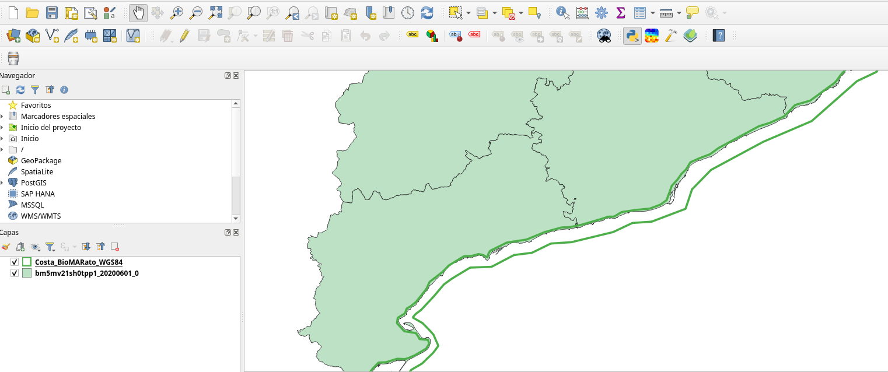
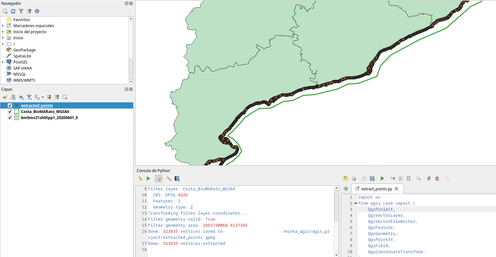
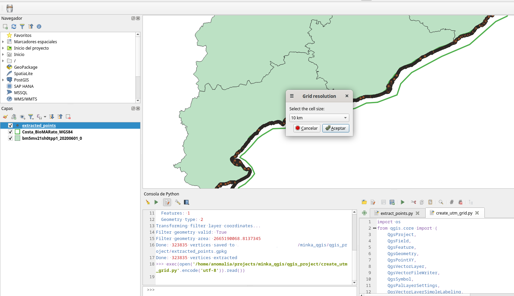
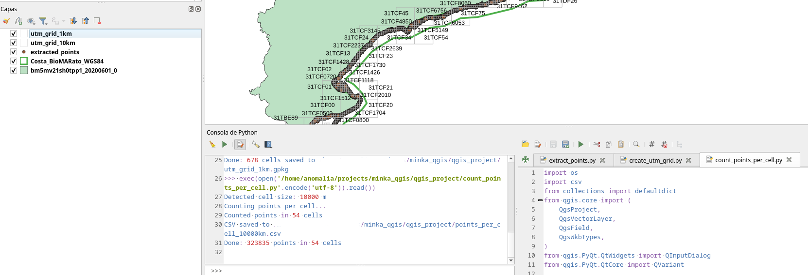

Spatial analysis of biodiversity using the [**MINKA**](https://minka-sdg.org) platform.

# QGIS UTM Grid Tools

Scripts for QGIS to analyze data on UTM grids.

## Requirements

- QGIS 3.x
- Saved QGIS project (so files are saved to the project directory) with map and polygon of interest loaded.



## Workflow

The process consists of 3 steps executed in order:

### 1. Extract points from polygon (`extract_points.py`)

Extracts vertices from a polygon (e.g., coastline) that fall within an area defined by another polygon.

**Usage:**
1. Run the script in the QGIS Python console
2. Select the source polygon layer (to extract vertices from)
3. Select the polygon layer that defines the filter area

**Output:**
- Point layer `extracted_points.gpkg` saved to the project directory
- Each point has attributes: `id`, `x`, `y`, `source_id`


---

### 2. Create UTM grid (`create_utm_grid.py`)

Creates a UTM grid (10 km or 1 km) only in cells where there are extracted points.

**Usage:**
1. Run the script in the QGIS Python console
2. Select the points layer (`extracted_points`)
3. Select the grid resolution (10 km or 1 km)

**Output:**
- Grid layer `utm_grid_10km.gpkg` or `utm_grid_1km.gpkg` saved to the project directory
- Each cell has the `mgrs` attribute with the corresponding MGRS code



**Note**: Run two times the script if you want both grids (10kms and 1km), one choosing every resolution.

---

### 3. Count points per cell (`count_points_per_cell.py`)

Counts how many points are in each grid cell and saves the result to a CSV file.

**Usage:**
1. Run the script in the QGIS Python console
2. Select the UTM grid layer
3. Select the points layer

**Output:**
- `points` field added to the grid layer
- CSV file `points_per_cell_{step}km.csv` saved to the project directory with columns:
  - `mgrs`: MGRS code of the cell
  - `points`: number of points in the cell



---

## File structure

```
qgis_project/
├── <polygon_layer.gpkg> / <polygon_layer.csv>
├── <map_layer.shp>
├── project.qgz
├── extracted_points.gpkg
├── utm_grid_10km.gpkg
├── utm_grid_1km.gpkg
├── points_per_cell_10000.csv
└── points_per_cell_1000.csv
```

## Running scripts

To run a script in QGIS:

1. Open the Python console: `Plugins` → `Python Console`
2. Run:
```python
exec(open('/path/to/script.py').read())
```

Or drag the `.py` file into the Python console.
